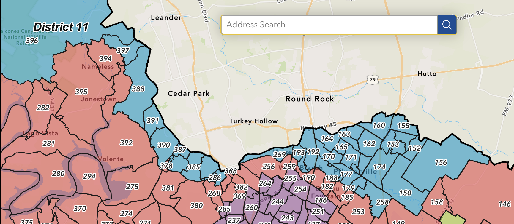

# Quick and Dirty Voter Record Checker

The goal of this mini-project is to find out, by precinct, how many people have already voted, looking specifically at TX-11 in Travis County.

`OLD-tx11-districts.txt` are the current districts (pre-redistricting).

`tx11-districts.txt` are the districts people are voting in for 2026.

The data is fresh as of the morning of Monday, March 2, 2026. There will be a few more votes to process through Mail Ballots through March 4. There will be some provisional votes left to count in March as well.

And obviously, this doesn't cover Election Day on March 3. That's in the future.

Source files are all public:

## Voter Turnout (Early Voting and Mail Ballot)
https://votetravis.gov/current-election-information/current-election/ (Reports tab)

## PLANC2333 District Files
https://data.capitol.texas.gov/dataset/planc2333/resource/fb6d5523-8ee2-40bd-97b6-256c42802060

## Travis County Maps and GIS data

https://voter-registration-maps-traviscountytx.hub.arcgis.com/pages/maps-and-gis-data

Specifically, the Travis County map, by precinct, for TX-11 is partially screenshotted here:

This covers all of TX-11 that is within Travis County: 150,152,153,154,155,156,160,161,162,163,164,165,170,171,172,173,174,177,178,180,188,191,192,193,258,269,278,286,368,383,384,385,386,387,388,390,391,396,397
