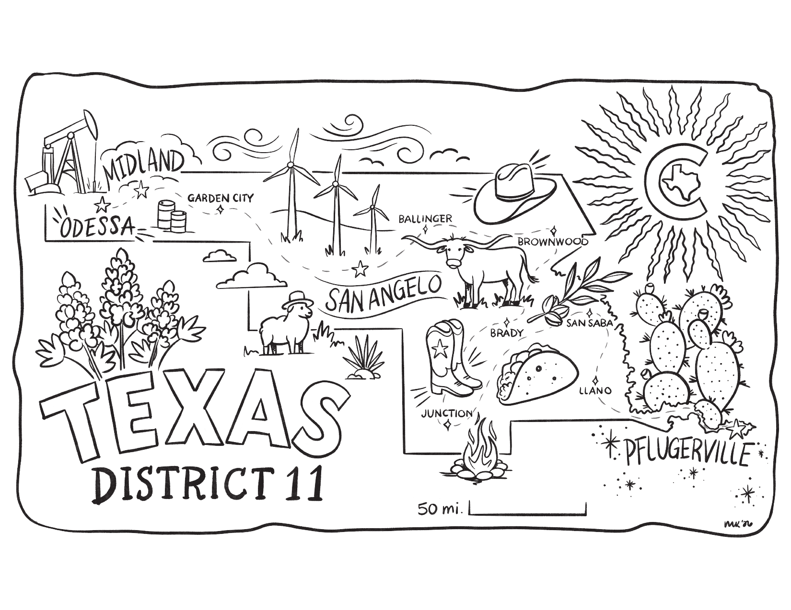

# Whimsical Map of Texas Congressional District 11

A delightful illustrated map of the new Texas Congressional District 11, created by Mallory Keeks. No AI was used in the drawing or rendering of this map! This whimsical artist's rendering of TX-11 is, incidentally, perfectly to scale with the real TX-11 borders as defined in the [PLANC2333](https://github.com/texas-district-11-outpost/texas-district-11-outpost.github.io/tree/main/plan-maps/PLANC2333) data provided by the Texas legislature.

## Low-Resolution Black and White

Perfect for printing coloring pages for kids of all ages!

[📥 Download low-res black and white version (6.5 MB)](whimsy-map-lowres.pdf)

## High-Resolution Full Color

Perfect for printing handsome wall posters, among other objets d'art!

[📥 Download high-res color version (38 MB)](whimsy-map-hires.png)

## License

These images are licensed under the [Creative Commons Attribution-NonCommercial-ShareAlike 4.0 International License](https://creativecommons.org/licenses/by-nc-sa/4.0/).

**You are free to:**

- Share — copy and redistribute the material in any medium or format
- Adapt — remix, transform, and build upon the material

**Under the following terms:**

- Attribution — you must give appropriate credit to Mallory Keeks
- NonCommercial — you may not use the material for commercial purposes
- ShareAlike — if you remix, transform, or build upon the material, you must distribute your contributions under the same license

**Map created by:** Mallory Keeks
